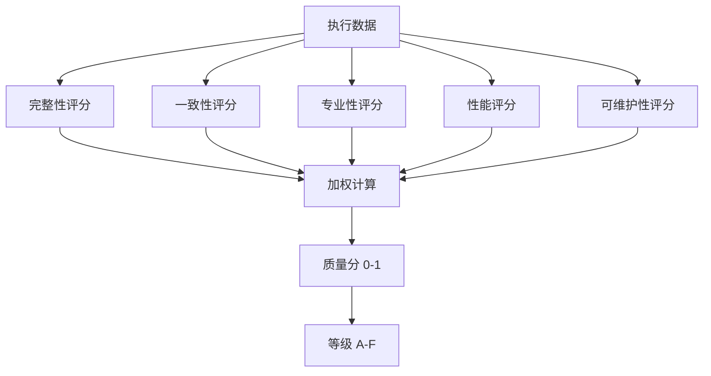
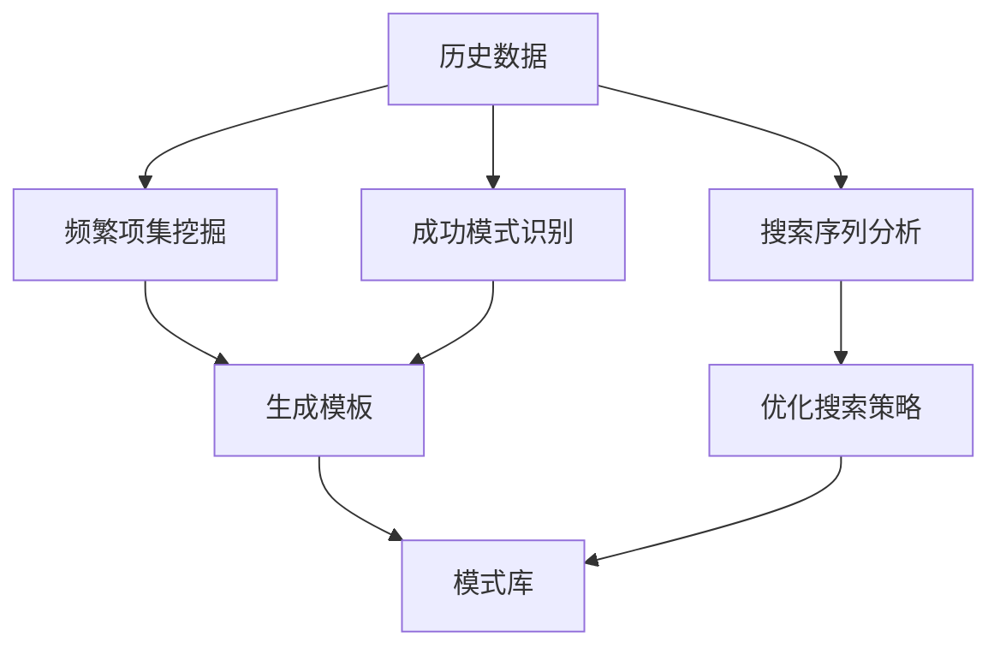
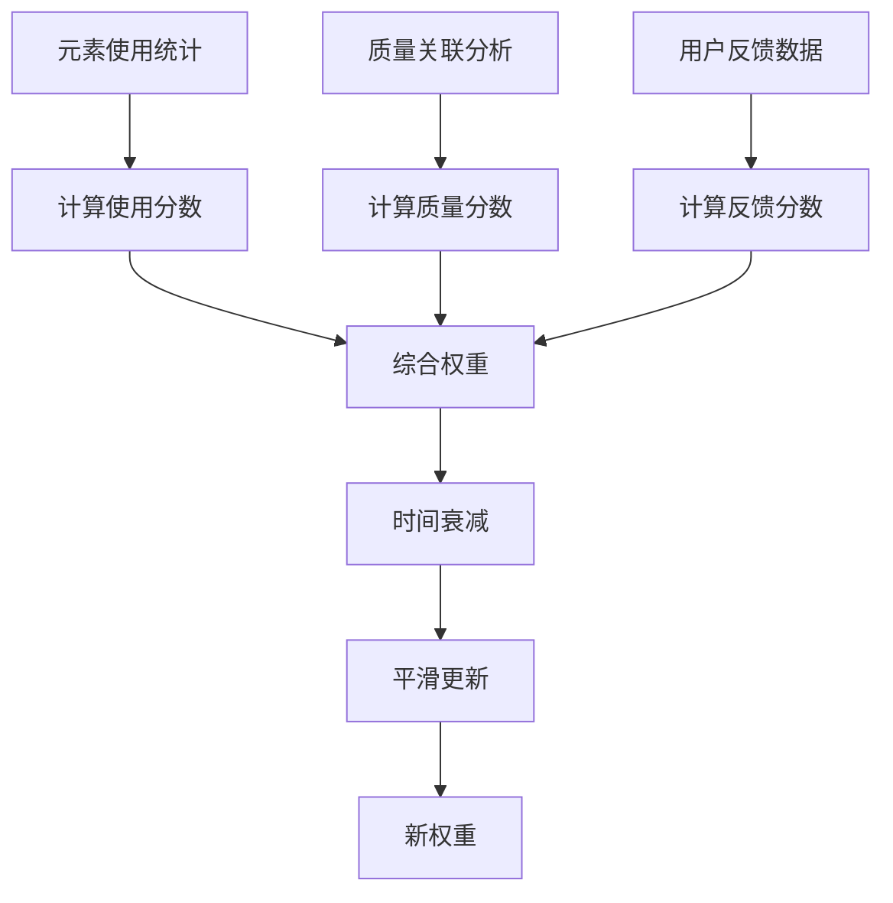
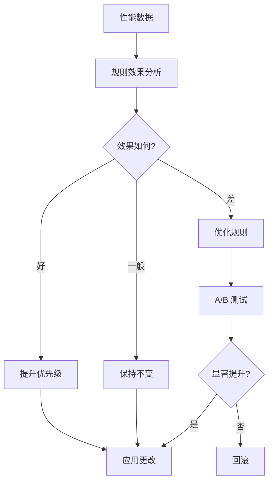
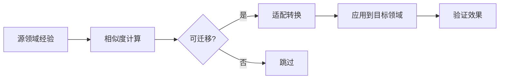

# Self-Evolution Skill 设计方案总结

## 🎯 核心理念

Self-Evolution 是一个**元级（Meta-level）技能系统**，它的独特之处在于：

1. **不直接为用户工作** - 而是监控和优化其他技能
2. **持续自我改进** - 通过数据分析自动进化
3. **被动式运行** - 在后台默默工作，不干扰用户
4. **数据驱动** - 所有优化都基于实际使用数据

> "最好的工具是你感觉不到它的存在，但它让你的工作越来越顺畅。"

---

## 🏗️ 架构概览

```
┌─────────────────────────────────────────────────────────────┐
│                    Self-Evolution Skill                     │
│                      (Meta-Level)                           │
├─────────────────────────────────────────────────────────────┤
│                                                              │
│  ┌─────────────┐  ┌─────────────┐  ┌─────────────┐        │
│  │  质量评估器  │  │  反馈学习器  │  │  模式发现器  │        │
│  │   (评估)    │  │   (学习)    │  │   (挖掘)    │        │
│  └──────┬──────┘  └──────┬──────┘  └──────┬──────┘        │
│         │                 │                 │                │
│         └─────────────────┼─────────────────┘                │
│                           │                                  │
│  ┌─────────────┐  ┌──────▼──────┐  ┌─────────────┐        │
│  │  权重优化器  │  │  框架进化器  │  │  知识迁移器  │        │
│  │   (优化)    │  │   (进化)    │  │   (迁移)    │        │
│  └─────────────┘  └─────────────┘  └─────────────┘        │
│                                                              │
├─────────────────────────────────────────────────────────────┤
│                       数据层                                 │
│  ┌──────────┐  ┌──────────┐  ┌──────────┐  ┌──────────┐  │
│  │ 执行数据  │  │ 反馈数据  │  │ 模式库    │  │ 权重库    │  │
│  └──────────┘  └──────────┘  └──────────┘  └──────────┘  │
└─────────────────────────────────────────────────────────────┘
         ▲                                            │
         │                                            ▼
┌────────┴────────────────────────────────────────────────────┐
│                    被监控的 Skills                           │
│  ┌──────────────┐  ┌──────────────┐  ┌──────────────┐    │
│  │ ui-ux-pro-max│  │  browser-use │  │  code-review │    │
│  └──────────────┘  └──────────────┘  └──────────────┘    │
└─────────────────────────────────────────────────────────────┘
```

---

## 🔄 工作流程

### 阶段 1: 数据收集（被动）


**关键点**:
- 完全自动，无需用户干预
- 异步处理，不影响性能
- 匿名化敏感信息

### 阶段 2: 质量评估（自动）



**关键点**:
- 多维度评估
- 可配置阈值
- 自动分级

### 阶段 3: 模式发现（定期）



**关键点**:
- 使用 Apriori 算法
- 最小支持度/置信度
- 自动生成模板

### 阶段 4: 权重优化（每日）



**关键点**:
- 三维评分体系
- 时间衰减机制
- 平滑更新避免剧变

### 阶段 5: 框架进化（每周）



**关键点**:
- 数据驱动优化
- A/B 测试验证
- 统计显著性要求

### 阶段 6: 知识迁移（按需）



**关键点**:
- 领域相似度分析
- 智能适配转换
- 效果验证

---

## 📊 数据模型

### 执行记录

```typescript
interface ExecutionRecord {
  session_id: string;
  timestamp: string;
  date: string;

  // Skill 信息
  skill_name: string;
  skill_args: string;

  // 触发上下文
  trigger: {
    user_request: string;
    detected_keywords: string[];
    context: {
      tech_stack: string;
      project_type: string;
      cwd: string;
    };
  };

  // 执行信息
  execution: {
    start_time: string;
    duration_ms: number;
    tool_calls: ToolCall[];
    searches_performed: Search[];
    elements_used: {
      styles: string[];
      colors: string[];
      fonts: string[];
      components: string[];
    };
  };

  // 输出信息
  output: {
    code_lines: number;
    components_count: number;
    has_responsive: boolean;
    has_dark_mode: boolean;
    file_operations: number;
  };

  // 质量评估
  quality_score?: number;
  quality_breakdown?: {
    completeness: number;
    consistency: number;
    professionalism: number;
    performance: number;
    maintainability: number;
  };
  quality_grade?: 'A' | 'B' | 'C' | 'D' | 'F';

  // 用户反馈
  user_feedback: {
    modified: boolean | null;
    rating: number | null;
    comments: string[];
  };
}
```

### 模式定义

```typescript
interface Pattern {
  id: string;
  type: 'combination' | 'sequence' | 'success';
  frequency: number;
  confidence: number;

  // 组合模式
  elements?: string[];

  // 序列模式
  sequence?: string[];

  // 成功模式
  common_features?: {
    styles: string[];
    colors: string[];
    fonts: string[];
    structure: any;
  };

  // 元数据
  discovered_at: string;
  last_seen: string;
  quality_score: number;
}
```

### 权重定义

```typescript
interface Weight {
  element_id: string;  // "style:minimalism"
  element_type: string;  // "style" | "color" | "font"
  element_value: string;  // "minimalism"

  // 权重计算
  usage_score: number;     // 使用频率
  quality_score: number;   // 质量关联
  feedback_score: number;  // 反馈评分

  // 综合权重
  weight: number;  // 0-1

  // 时间衰减
  last_used: string;
  decay_factor: number;

  // 趋势
  trend: 'rising' | 'stable' | 'declining';

  // 元数据
  created_at: string;
  updated_at: string;
}
```

---

## 🎯 关键指标（KPI）

### 输入指标

| 指标 | 描述 | 目标 |
|------|------|------|
| **执行次数** | 总 skill 执行次数 | 越多越好 |
| **数据完整性** | 成功记录的执行比例 | ≥ 95% |
| **反馈收集率** | 收集到反馈的比例 | ≥ 50% |

### 输出指标

| 指标 | 描述 | 目标 |
|------|------|------|
| **平均质量分** | 所有执行的平均质量 | ≥ 0.85 |
| **用户满意度** | 用户评分平均值 | ≥ 4.5/5 |
| **修改率** | 用户修改代码的比例 | ≤ 15% |
| **复用率** | 元素被复用的比例 | ≥ 60% |

### 改进指标

| 指标 | 描述 | 目标 |
|------|------|------|
| **质量提升率** | 每月质量分增长 | +5% |
| **修改率下降** | 每月修改率减少 | -10% |
| **模式发现数** | 每月新发现模式 | ≥ 5 |
| **权重优化数** | 每月权重调整 | ≥ 20 |

---

## 💡 创新点

### 1. 元级设计

- **监控者而非执行者** - 不直接工作，而是优化工作方式
- **递归改进** - 改进系统本身的改进能力
- **自我认知** - 知道自己哪里好、哪里差

### 2. 闭环学习

```
执行 → 评估 → 学习 → 优化 → 应用 → 执行
     ↑                               ↓
     └───────────── 反馈 ─────────────┘
```

- 完整的反馈循环
- 持续不断的改进
- 无需人工干预

### 3. 数据驱动

- **A/B 测试** - 验证每个优化假设
- **统计显著性** - 只应用有效的改进
- **多维评估** - 全面衡量质量

### 4. 跨域迁移

- **知识复用** - 成功经验迁移
- **快速启动** - 新领域快速达到高质量
- **智能适配** - 自动转换不同领域

### 5. 用户中心

- **隐式学习** - 从行为中学习偏好
- **渐进优化** - 不打断工作流程
- **完全透明** - 用户可查看和控制

---

## 🚀 实施路线图

### Phase 1: 基础建设（2周）

- ✅ 创建 skill 结构
- ✅ 实现数据收集 hooks
- ✅ 编写分析脚本
- ✅ 配置自动运行

**里程碑**: 成功收集第一批执行数据

### Phase 2: 核心功能（4周）

- ⬜ 实现质量评估器
- ⬜ 实现反馈学习器
- ⬜ 实现模式发现器
- ⬜ 生成首份质量报告

**里程碑**: 发现第一个高质量模式

### Phase 3: 优化系统（4周）

- ⬜ 实现权重优化器
- ⬜ 实现框架进化器
- ⬜ A/B 测试框架
- ⬜ 验证优化效果

**里程碑**: 质量分提升 10%

### Phase 4: 高级特性（4周）

- ⬜ 实现知识迁移器
- ⬜ 自动模板生成
- ⬜ 跨域适配
- ⬜ 用户偏好学习

**里程碑**: 成功完成一次知识迁移

### Phase 5: 生产优化（持续）

- ⬜ 性能优化
- ⬜ 可视化仪表板
- ⬜ 告警系统
- ⬜ 扩展性增强

**里程碑**: 稳定运行，零干扰

---

## 📈 预期效果

基于设计目标，预期在 **3 个月** 内达到：

### 质量改进

```
平均质量分: 0.75 → 0.90 (+20%)
A级占比: 10% → 45% (+350%)
F级占比: 15% → 2% (-87%)
```

### 效率提升

```
用户修改率: 25% → 10% (-60%)
平均迭代次数: 2.3 → 1.4 (-39%)
首次成功率: 45% → 75% (+67%)
```

### 用户体验

```
用户满意度: 4.0 → 4.7 (+17.5%)
推荐意愿: 65% → 90% (+38%)
活跃用户: 保持或增长
```

---

## 🎓 适用场景

Self-Evolution 特别适合：

### ✅ 适用

1. **高频使用的 skills** - 数据越多，学习越好
2. **有明确质量标准** - 便于评估改进
3. **用户有反馈行为** - 提供学习信号
4. **迭代式工作** - 持续优化有价值

### ❌ 不适用

1. **一次性任务** - 没有学习机会
2. **主观性太强** - 难以评估质量
3. **用户无反馈** - 无法学习偏好
4. **任务差异巨大** - 难以迁移知识

---

## 🔒 隐私和安全

### 数据保护

- ✅ **本地存储** - 所有数据本地，不上传
- ✅ **匿名化** - 自动移除敏感信息
- ✅ **用户控制** - 可随时查看、导出、删除
- ✅ **透明度** - 完全开源，可审计

### 性能影响

- ✅ **异步处理** - 不阻塞主流程
- ✅ **资源限制** - CPU/内存有上限
- ✅ **可配置** - 可调整收集频率
- ✅ **可禁用** - 不满意可关闭

---

## 🎯 成功标准

Self-Evolution 的成功标准是：

1. **用户感觉不到它的存在**
   - 后台运行，零干扰
   - 自动优化，无需操作

2. **但工作越来越顺畅**
   - 生成质量持续提升
   - 修改需求持续减少
   - 满意度持续上升

3. **系统自己知道在改进**
   - 量化指标持续向好
   - 发现新模式和规律
   - 自适应用户变化

> "最好的工具是让用户忘记它的存在，但离不开它的帮助。"

---

## 📚 文档索引

- **[README.md](./README.md)** - 核心概念和架构
- **[skill.json](./skill.json)** - Skill 配置
- **[INTEGRATION.md](./INTEGRATION.md)** - 集成指南
- **[EXAMPLES.md](./EXAMPLES.md)** - 使用示例
- **[SUMMARY.md](./SUMMARY.md)** - 本文档

---

## 🤝 贡献

欢迎贡献改进想法和代码！

### 改进方向

- 🔍 更智能的模式识别算法
- 📊 更丰富的可视化仪表板
- 🤖 更准确的用户意图推断
- 🌐 跨栈知识迁移规则
- 🎯 领域特定优化策略

---

**设计者**: Claude Sonnet 4.5
**版本**: 1.0.0
**状态**: 设计完成，待实施
**最后更新**: 2026-01-10

---

**下一步**: 开始 Phase 1 - 基础建设 🚀
